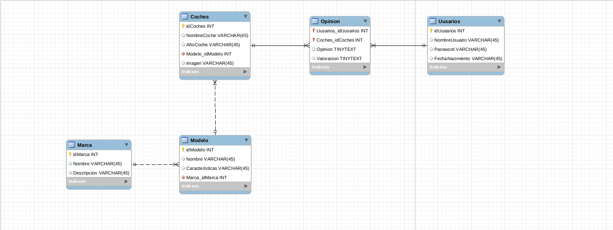
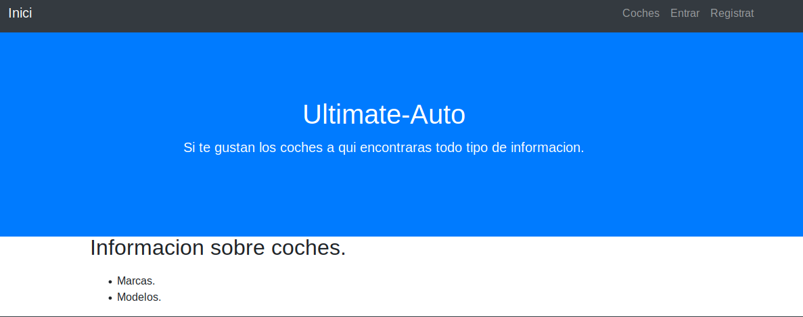
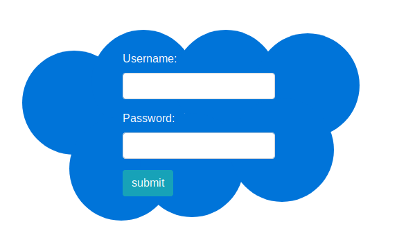
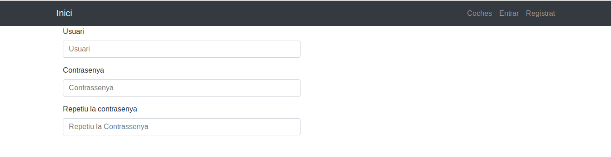
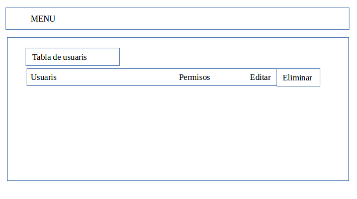

# ULTIMATE-AUTO

## Espeficiació del projecte Ultimate-Auto

### 1. Introducció

* **Títol del projecte**: Ultimate-Auto
* **Objectius**:
  * Desenvoupar un foro de cotxes per a la seua valoració.
* **Descripció** El projecte d'exemple que plantegem, Es un foro amb vehiculs per a valorar cada vehicul i donar una opinió del vehicul.
* **Desenvolupador**: @Gomis97, @rub2asix 
* **Adreça web en Github** https://github.com/2ASIX2018/Ultimate-Auto.git

### 2. Disseny

L'aplicació farà ús principalment de cinc taules a la base de dades, per tal de gestionar un foro de cotxes per una banda, i per altra la gestió dels usuaris.

#### 2.1. Descripció de la base de dades

L'esquema de la base de dades és la següent:

#### 2.2. Descripció de la interfície 

Les diferents pàgines de què es composarà l'aplicació seran:

* **Pàgina inicial**: Mostra el titol del la pagina web, amb informacio no molt detallada dels vehiculs que hi han en la pagina web.

* **Post**: accedim a una pàgina on es mostra tota la informació detallada del vehicul al que eu fet click

* **Formulari d'accés**: Quan un usuari registrat vol accedir a l'aplicació, ho farà a través del següent formulari:

* **Registre d’usuaris**: Ací es registraran tots aquells usuaris que vuiguen entrar en aquest foro.

* **Pàgina d'Administració**: L'usuari administrador podrà gestionar els diferents usuaris a través de la següent pàgina d'administració:

