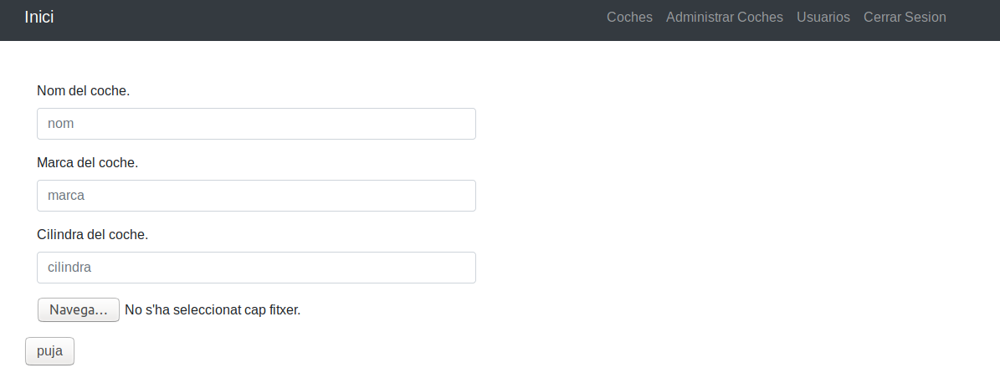
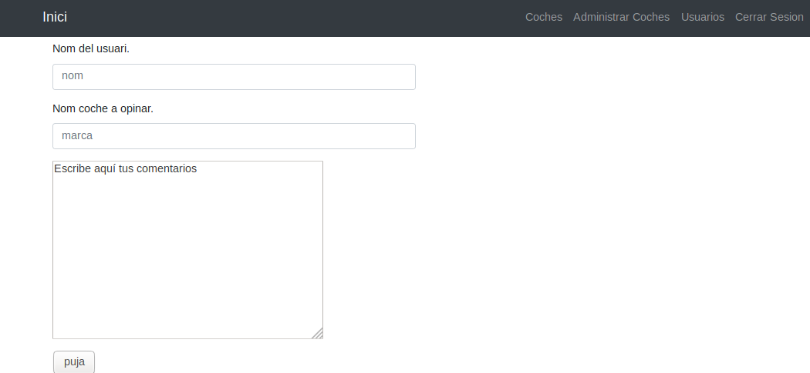
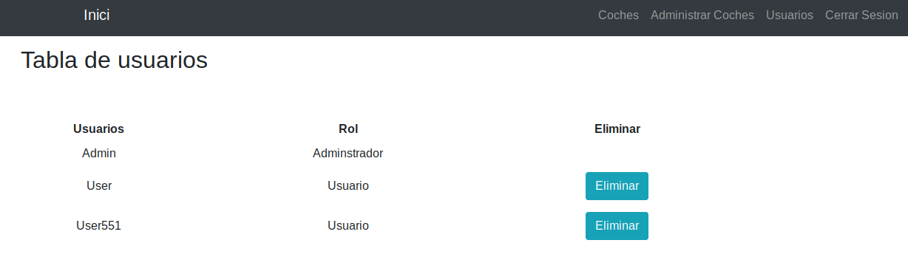

# Ultimate-Auto: Formularis i control de sessions.

En aquest sprint s'han afegit les següents novetats al codi:

* Incorporació de l'autenticació i el control de sessions al nostre lloc (encara sense fer l'accés a la base de dades).
* Implementació dels formularis de registre i login.
* Implementació del formulari de pujada de cotxes amb informació i imatgens del cotxe.
* Implementació del formulari de opinions del cotxe.
* Implementacio de gestió de usuaris.

A més, veureu que s'ha reorganitzat una miqueta el codi per introduir la programació orientada a objectes.

## Formulari de Login

El formulari de login s'ha renomenat a `entrar2.php`, i el contingut del formulari en sí és el següent:

```xml
 <form class="form" action="comprobar.php" method="POST" >
     <div class="form-group">
        <label for="username" class="text-white">Username:</label><br>
        <input type="text" required="required" name="username" id="username" class="form-control">
     </div>
     <div class="form-group">
         <label for="password" class="text-white">Password:</label><br>
         <input type="password" name="password" required="required" id="password" class="form-control">
     </div>
     <div class="checkbox">
         <label><input type="Checkbox" name="recordar" id="recordar" value="recordar"> Recorda'm en aquest ordinador
         </label>          
     </div>
     <div class="form-group">
         <input type="submit" name="submit" class="btn btn-info btn-md" value="submit">
     </div>
</form>
```

Fixeu-se en els següents detalls:

* El `action="comprobar.php"`, per indicar la pàgina a la que ens enviarà el formulari
* Hem fet ús d'una petició HTTP `POST` (`method="post"`) per enviar la informació del formulari.
* Hem afegit l'atribut `name` als tres camps que ens interessa, *"password"* i *"username"* *"recordar"* .
* Hem afegit un nou checkbox amb l'opció *"Recorda'm en aquest ordinador".*

## Accés al sistema i control de sessions

El fitxer login.php s'encarrega de validar els usuaris. Com que encara no hem vist accés a base de dades, farem una comprovació amb usuaris introduits directament al codi. Concretament els usuaris "admin" i "user", un amb permís d'administració i l'altre un usuari comú.

```xml

<?php
session_start();
$_SESSION['username']=$_POST['username'];
$_SESSION['password']=$_POST['password'];
$usuario=$_SESSION['username'];
$password=$_SESSION['password'];
$recordar=$_POST['recordar'];
 if ($usuario=="admin" && $password=="admin") {
    header ("Location: indexx.php");
    echo "Usuari registrat";
  } else if ($usuario=="user" && $password=="user") {
    header ("Location: indexx.php");
  } else {
    echo "MAl";
  };
  if ($usuario=="admin") {
    $_SESSION['role']="admin";
  } else { if ($usuario=="user")
    $_SESSION['role']="user";
  };
  if($recordar=="recordar") {
    setcookie('UltimateAutoUser', $_SESSION["username"], time() + 365 * 24 * 60 * 60);
    setcookie('UltimateAutoRole', $_SESSION["role"], time() + 365 * 24 * 60 * 60);
  //  echo "Recordat";
}
?>
```
## Consrtucció del menú

El següent pas és construir la barra de navegació en funció del tipus d'usuari de què es tracte. Recordem que, com que totes les pàgines tenen el menú comú, aquest es va introduir en un fitxer a banda. Ara, gràcies a això, només amb que modifiquem aquest fitxer, tindrem el menú modificat en totes les vistes.

L'inici del fitxer menu.php té el següent aspecte:

```xml

<?php
    if ($role=='user'){
?>
<br>
	    <li class="nav-item">
              <a class="nav-link js-scroll-trigger"></a>
            </li>
                     <li class="nav-item">
              <a class="nav-link js-scroll-trigger" href="coches.php">Coches</a>
            </li>
            <li class="nav-item">
              <a class="nav-link js-scroll-trigger" href="puj_coches.php">Administrar Coches</a>
            </li>
            <li class="nav-item">
              <a class="nav-link js-scroll-trigger" href="logout.php">Cerrar Sesion</a>
            </li>
         
<?php
    } else if ($role=='admin') {
?>
 
         
         
            <li class="nav-item">
              <a class="nav-link js-scroll-trigger" href="coches.php">Coches</a>
            </li>
            <li class="nav-item">
              <a class="nav-link js-scroll-trigger" href="puj_coches.php">Administrar Coches</a>
            </li>
            <li class="nav-item">
              <a class="nav-link js-scroll-trigger" href="altausuarios.php">Usuarios</a>
            </li>
	    <li class="nav-item">
              <a class="nav-link js-scroll-trigger" href="logout.php">Cerrar Sesion</a>
            </li>
<?php
} else {
?>
	    <li class="nav-item">
              <a class="nav-link js-scroll-trigger" href="entrar2.php">Entrar</a>
            </li>
	    <li class="nav-item">
              <a class="nav-link js-scroll-trigger" href="registrar.php">Registrat</a>
            </li>
<?php
}
?>

```

## Formulari de pujada de cotxes

Aquesta es el nostre formulari de pujart cotxes per a la pagina web:



I aquest es el codi:

```xml
<form action="comprobar.php" method="POST" id="userManager" class="col-md-6 col-md-offset-4 col-sm-offset-4 col-sm-6">
       
  <div class="form-group">
     <label for="NewUserName" >Nom del coche.</label>
		 <input type="text" required="required" class="form-control" name="nom" placeholder="nom">
   </div>
   <div class="form-group">
      <label for="NewUserPass1">Marca del coche. </label>
      <input type="password" required="required"ss1 name="contrasena" class="form-control"placeholder="marca">
    </div>
    <div class="form-group">
       <label for="NewUserPass2">Cilindra del coche.</label>
       <input type="password" required="required" class="form-control" id="NewUserPass2" placeholder="cilindra">
     </div>
     <div class="form-group">
     <form  method="post" action="action.cgi" enctype="multipart/form-data">
       <input type="file" name="nombre" required="required">
      </form> 
      </div>
        <input type="submit" value="puja" >
</form>    
```
## Formulari de opinions de cotxe

Aquesta es el nostre formulari de de opinions de cotxes:



I aquest es el codi:

```xml
<form action="comprobar.php" method="POST" id="userManager" class="col-md-6 col-md-offset-4 col-sm-offset-4 col-sm-6">
    <div class="form-group">
      <label for="NewUserName" >Nom del usuari.</label>
			<input type="text" required="required" class="form-control" name="nom" placeholder="nom">
    </div>
     <div class="form-group">
       <label for="NewUserPass1">Nom coche a opinar. </label>
       <input type="password" required="required"ss1 name="contrasena" class="form-control"placeholder="marca">
     </div>    
     <div class="form-group">
        <textarea name="comentarios" rows="10" cols="40">Escribe aquí tus comentarios</textarea> 
      </div>
      <input type="submit" value="puja" >
</form>    
```

## Formulari de gestio de usuaris

Aquesta es el nostre formulari de gestio de usuaris per a el administrador:



I aquest es el codi:

```xml

<div>
<h2 class="titulo"> Tabla de usuarios</h2>
<br><br>
<table class="tabla" >
  <tr>
    <th>Usuarios</th>
    <th>Rol</th> 
    <th>Eliminar</th>
  </tr>
  <tr>
    <td>Admin</td>
    <td>Adminstrador</td>
    <td></td>
  </tr>
  <tr>
    <td>User</td>
    <td>Usuario</td>
    <td><input type="submit" name="submit" class="btn btn-info btn-md" value="Eliminar"></td>
  </tr>
  <tr>
    <td>User551</td>
    <td>Usuario</td>
    <td><input type="submit" name="submit" class="btn btn-info btn-md" value="Eliminar"></td>
  </tr>
</table>

</div>

```


